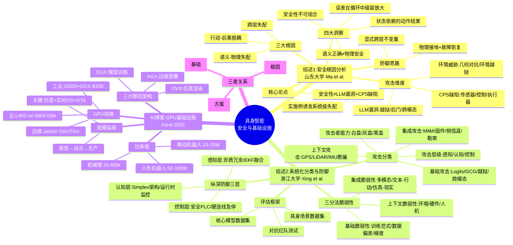

# 具身智能安全与基础设施 — 三篇文章思维导图

> 涵盖：综述1（安全根因）、综述2（系统化分类与防御）、AI博客（GPU基础设施）

---

## 一、Mermaid 可视化思维导图

> 在支持 Mermaid 的编辑器（VS Code、Typora、GitHub、Obsidian 等）中可直接渲染为图形。



---

## 二、文本树状思维导图（任意环境可读）

```
                          ┌─────────────────────────────────┐
                          │   具身智能安全与基础设施（三篇）   │
                          └────────────────┬────────────────┘
                                           │
        ┌──────────────────────────────────┼──────────────────────────────────┐
        │                                  │                                  │
   【综述1】安全根因                   【综述2】系统分类与防御            【AI博客】GPU基础设施
   山东大学·Ma et al.                  浙江大学·Xing et al.               Introl·2025
        │                                  │                                  │
        ├─ 核心论点                         ├─ 三分法脆弱性                     ├─ 三计算机架构
        │   ├─ ≠单纯LLM漏洞+CPS缺陷        │   ├─ 基础脆弱性(训练/数据/梯度)    │   ├─ DGX 训练
        │   └─ 实施例诱发系统级失配         │   ├─ 集成脆弱性(多模态/接口)        │   ├─ OVX 仿真
        │                                  │   └─ 上下文脆弱性(环境/人机)       │   └─ AGX 部署
        ├─ 四大洞察                         │                                  │
        │   ├─ 语义正确≠物理安全            ├─ 攻击分类                         ├─ GPU规格
        │   ├─ 状态依赖的动作结果           │   ├─ 能力: 白/灰/黑盒              │   ├─ 云: L40S(G6e)
        │   ├─ 误差级联放大                 │   ├─ 层级: 感知/认知/控制          │   ├─ 工业: 1万×B200
        │   └─ 安全性不可组合               │   ├─ 基础: Logits/GCG/越狱         │   └─ 边缘: Orin/Thor
        │                                  │   ├─ 集成: MitM/固件/侧信道        │
        ├─ 三大根因 ★                       │   └─ 上下文: GPS/LiDAR/IMU欺骗     ├─ 功率谱
        │   ├─ 语义-物理失配                │                                  │   ├─ 移动机器人 10-25W
        │   ├─ 行动-后果脱耦                 ├─ 纵深防御三层 ★                   │   ├─ 机械臂 15-60W
        │   └─ 跨层失配(核心)               │   ├─ 感知层: 异质冗余+EKF           │   └─ 人形机器人 50-100W
        │                                  │   ├─ 认知层: Simplex+监控          │
        ├─ 攻击维度                         │   └─ 控制层: 安全PLC+急停           ├─ 规模指南
        │   ├─ LLM: 越狱/后门/跨模态        │                                  │   ├─ 原型(1-4 GPU)
        │   ├─ CPS: 传感器/控制/执行器      ├─ 评估框架                         │   ├─ 试点(8-32)
        │   └─ 环境: 几何对抗/越狱          │   ├─ 核心模型数据集                │   ├─ 生产(32-128)
        │                                  │   ├─ 具身场景数据集                │   └─ 多站点(128-512)
        └─ 防御: 显式跨层不变量             │   └─ 对抗红队测试                  │
                                           └─ 哲学: 纵深防御、分层遏制          └─ 关键: Sim2Real+RTOS+OTA


═══════════════════════════════════════════════════════════════════════════════
                         三篇文章的互补关系
═══════════════════════════════════════════════════════════════════════════════

    【综述1】                 【综述2】                  【AI博客】
   为什么出问题      →     如何防御攻击        →      用什么部署运行
   (根因诊断)              (系统化方案)              (硬件基础设施)
      深度                    广度                     工程实现

         └──────── 理解根本原因 ────────┬──────── 部署防御 ────────┘
                                        ↓
                          完整的具身AI安全工程闭环
```

---

## 三、核心要点速记（一页纸）

| 维度 | 综述1（根因） | 综述2（分类防御） | AI博客（基础设施） |
|------|-------------|-----------------|------------------|
| **核心问题** | 是什么破坏了安全？ | 如何使其鲁棒安全？ | 需要什么硬件？ |
| **方法论** | 根因导向 | 分类法导向 | 工程实践导向 |
| **独特贡献** | 三大根因（跨层失配为核心） | 三分法脆弱性+纵深防御 | 三计算机架构 |
| **关键概念** | 语义-物理失配 | 基础/集成/上下文脆弱性 | DGX/OVX/AGX |
| **防御重点** | 跨层不变量 | 异构冗余+Simplex+安全PLC | 仿真+实时OS+OTA |
| **哲学** | 安全不可组合 | 纵深防御 | 规模化工程 |

---

> **生成日期**：2026年7月26日
